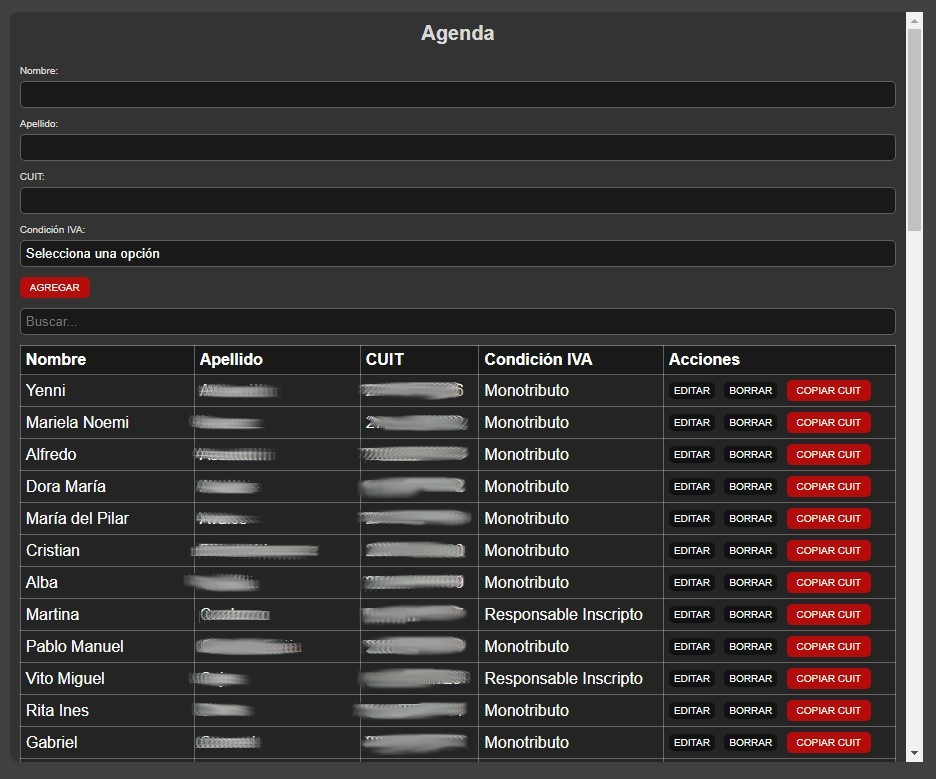

La agenda permite cargar datos de contribuyentes, editarlos, borrarlos.

Además cuenta con un buscador para filtrar los datos y un botón para copiar con facilidad el CUIT.

Esto facilita el workflow de los contadores que contamos con una lista de clientes extensa. 

Guardar en Marcadores para tener acceso rapido y en el mismo buscador que se está trabajando.

Ejemplo de visualización:

